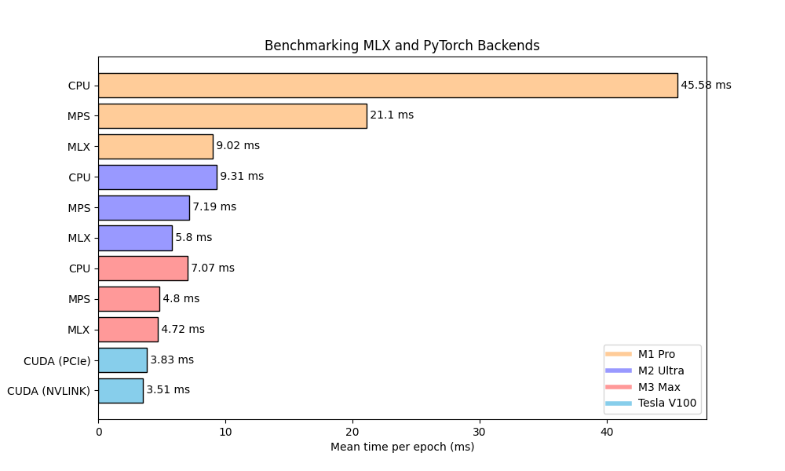

# Graph Convolutional Network in MLX

An example of [GCN](https://arxiv.org/pdf/1609.02907.pdf%EF%BC%89) implementation with MLX. Other examples are available <a href="https://github.com/ml-explore/mlx-examples">here</a>.

The acutal MLX code is in `main.py`, whereas the PyTorch equivalent is in `main_torch.py`.

### Install env and requirements

```
CONDA_SUBDIR=osx-arm64 conda create -n mlx python=3.10 numpy -c conda-forge
conda activate mlx
pip install -r requirements.txt
```

### Run
To try the model, just run the `main.py` file. This will download the Cora dataset, run the training and testing.

```
python main.py
```

### Run benchmark
To run benchmark on torch_mps | torch_cpu | torch_cuda, a new env needs to be set up without the `CONDA_SUBDIR=osx-arm64` prefix, to be in i386 mode and not arm. Additional dependencies like `torch` also need be installed in the env to run these benchmark.
```
python benchmark.py --experiment=[ mlx | torch_mps | torch_cpu | torch_cuda ]
```

### Process benchmark figure
This needs to install additional packages: `matplotlib` and `scikit-learn`.

```
python viz.py
```


